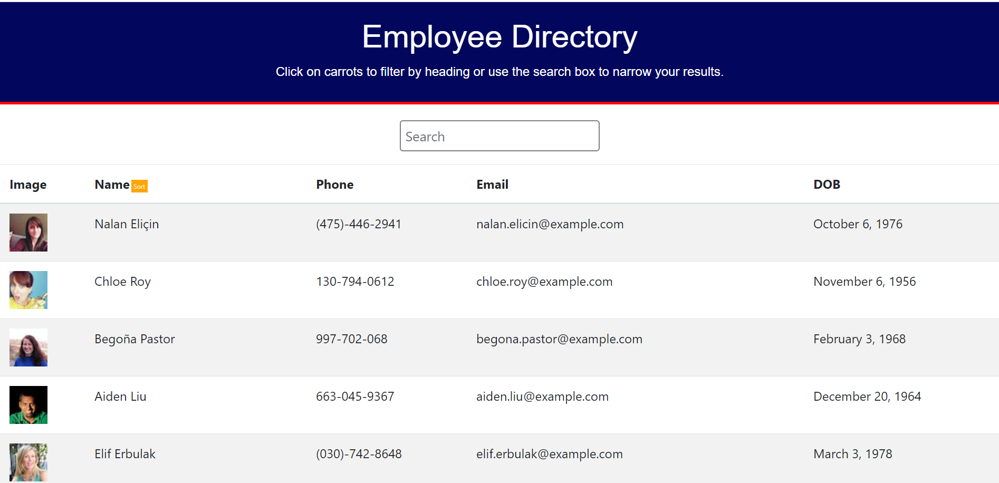

# Employee Directory -- Homework 19

## Description  
A searchable, sortable employee directory built with React and the randomuser.me API. 

## Table of Contents

* [Technologies Used](#technologies-used)

* [How to Use](#how-to-use)

* [How I Made This](#how-i-made-this)

* [Deployed Application](#application-deployed-with-heroku)

* [GitHub Repo](#link-to-github-repo)

* [Future Development Ideas](#future-development-ideas)  

## Technologies Used  
Built in Visual Studio with          
HTML       
CSS  
Bootstrap        
Javascript        
Node.js     
React  
Axios      
Moment.js  
Randomuser.me API    

## How to Use    
Navigate to . 
   
  

## How I Made This      

## Application Deployed With GitHub Pages  
https:

## Link to GitHub Repo    
https://github.com/alyssahellrung/react_employee_directory  

## Future Development Ideas
--Ability to sort based on every category (not just last name)